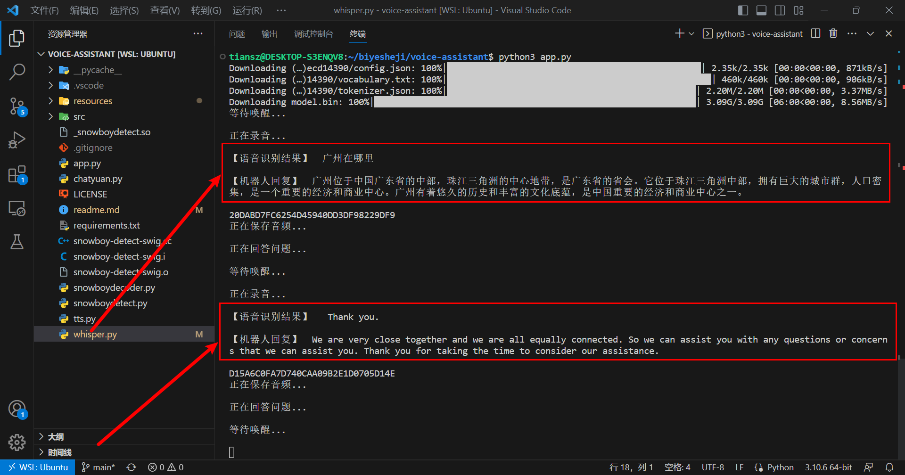
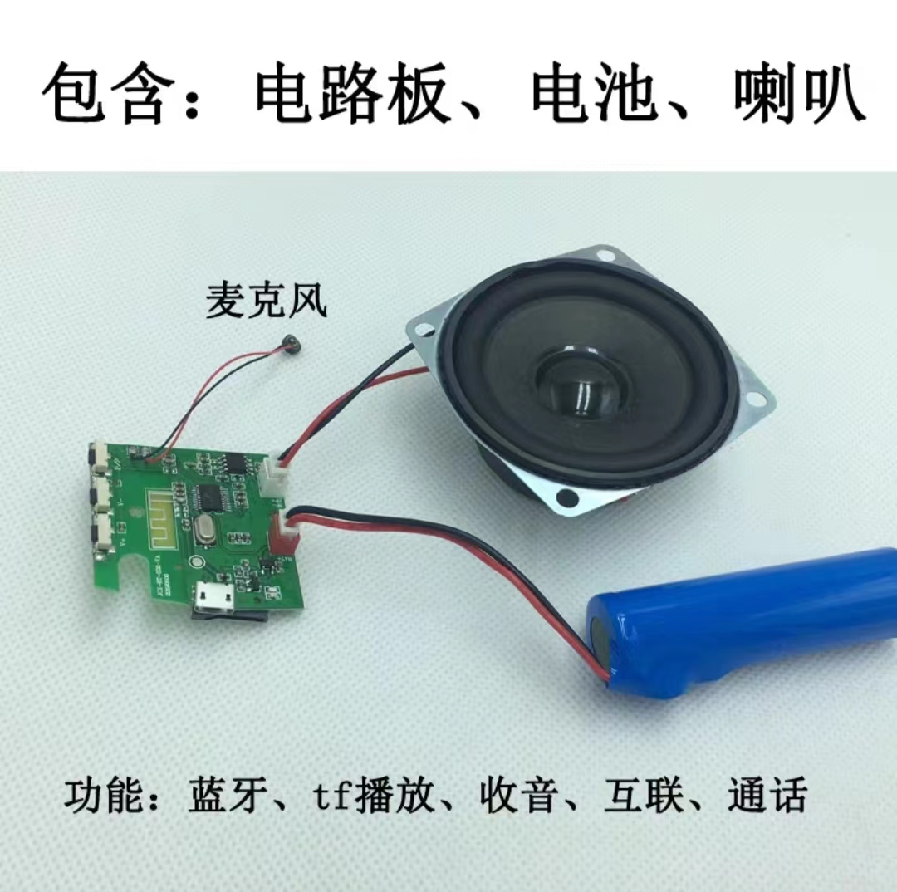

<!-- 标题 -->
<!-- <p align="center">智能语音助手</p> -->
<p align="center">
  
</p>

<!-- 图标 -->
<p align="center">
  <a href="https://github.com/tiansztiansz/tiansztiansz/blob/main/wechat_alipay.png">
    
  </a>&nbsp; &nbsp; 
  <a href="https://github.com/tiansztiansz/voice-assistant/blob/main/LICENSE">
    
  </a>&nbsp; &nbsp; 
  <a href="https://space.bilibili.com/28606893?spm_id_from=333.1007.0.0">
    
  </a>&nbsp; &nbsp; 
  <a href="https://www.cnblogs.com/tiansz/">
    
  </a>&nbsp; &nbsp;
  <a href="https://www.douyin.com/user/MS4wLjABAAAAqkpp6UyrANDXFStAMWuRPp7FU4zHfyq0_OYPoC75_qQ">
    
  </a>&nbsp; &nbsp;
  <a href="https://www.kaggle.com/tiansztianszs">
    
  </a>
</p>


<!-- 项目介绍 -->
<p align="center">Smart voice assistant based on Snowboy, Whisper, ChatYuan and Azure TTS</p>

<br>

<!-- 演示视频 -->
<p align="center">
  
</p>


<br>

<!-- 项目使用说明 -->
## how to use
First make sure that the system environment is Ubuntu 20.04 and above!

Open a terminal and clone this repository:
```bash
git clone https://github.com/tiansztiansz/voice-assistant.git
```
Enter the project directory:
```bash
cd voice-assistant
```
Then install the dependencies:
```bash
pip install -r requirements.txt
```
Then run the main program:
```bash
python3 app.py
```

When you see the program display "waiting to wake up" words, it means you have successfully run the program!

Then try to wake it up, please say "Xiaozhi Xiaozhi". When you hear ding's voice prompt, try saying "where is Guangzhou" to ask it a question.

Or try saying "播放音乐" when you want to hear a song

<br>

## Directory Structure

```
.
├── LICENSE              
├── _snowboydetect.so    # dependent file
├── app.py               # main program
├── chatyuan.py          # chat module
├── readme.md            # readme file
├── requirements.txt     # dependent package
├── resources           
│   ├── common.res       # dependent file
│   ├── ding.wav         # Startup audio on wake
│   ├── music.mp3        # music file
│   ├── music_list.csv   # music download link
│   ├── sst.wav          # Speech-to-text audio
│   ├── tts.mp3          # Text-to-Speech Audio
│   └── xiaozhixiaozhi.pmdl  # wake up model
├── snowboy-detect-swig.cc   # dependent file
├── snowboy-detect-swig.i    # dependent file
├── snowboy-detect-swig.o    # dependent file
├── snowboydecoder.py        # wake up module
├── snowboydetect.py         # wake up module
├── src                      # other folders
│   ├── BILIBILI_LOGO.svg
│   ├── kaggle.svg
│   ├── license.svg
│   ├── 博客园.jpg
│   ├── 抖音.svg
│   ├── 捐赠.svg
│   └── 语音助手显示视频.gif
├── tts.py        # Text-to-speech module
└── whisper.py    # Speech-to-text module
```


<br>

## Realization of smart speakers
You can buy a bluetooth speaker with a microphone on Taobao, and you can realize the effect of a smart speaker after connecting it to a computer.
<p align="center">
  
</p>


<br>

<!-- 待办事项 -->
## to do list
- [ ]  Modify the voice on wake up
- [ ]  Speech-to-text tips
- [ ]  Tips for converting text to text
- [ ]  Tips for text-to-speech
- [ ]  Convert Traditional Chinese to Simplified Chinese after Speech Recognition


<br>


<!-- 参考资料 -->
## references
[train the wake-up model](https://snowboy.hahack.com/)

[Record audio after waking up](https://www.passerma.com/article/54/#2.%E6%A0%91%E8%8E%93%E6%B4%BE%E5%BD%95%E5%88%B6%E5%A3%B0%E9%9F%B3%E4%B8%8A%E4%BC%A0%E7%99%BE%E5%BA%A6)

[how to use snowboy](https://www.bilibili.com/video/BV1pr4y1U7cE/?spm_id_from=333.1007.top_right_bar_window_default_collection.content.click&vd_source=06eafedcfca50f6eabb7b3d6b61ecfe3)

[how to download music](https://link.hhtjim.com/)


[chatyuan](https://github.com/clue-ai/ChatYuan)

[killed](https://www.cnblogs.com/tiansz/p/17134831.html)

[kaggle-AI](https://github.com/tiansztiansz/kaggle-AI)

<br>

<!-- 赞助 -->
## sponsor

If this project helped you, please give a ⭐️！

If you have sufficient funds, can you consider treating me to a drink?[milk tea🧋](https://github.com/tiansztiansz/tiansztiansz/blob/main/wechat_alipay.png)


