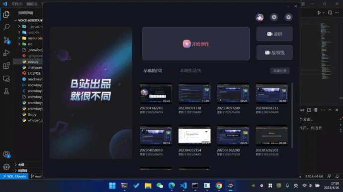

<!-- 标题 -->
<h1 align="center">智能语音助手</h1>


<!-- 图标 -->
<p align="center">
  <a href="https://github.com/tiansztiansz/tiansztiansz/blob/main/wechat_alipay.png">
    
  </a>&nbsp; &nbsp; 
  <a href="https://github.com/tiansztiansz/voice-assistant/blob/main/LICENSE">
    
  </a>&nbsp; &nbsp; 
  <a href="https://space.bilibili.com/28606893?spm_id_from=333.1007.0.0">
    
  </a>&nbsp; &nbsp; 
  <a href="https://www.cnblogs.com/tiansz/">
    
  </a>&nbsp; &nbsp;
  <a href="https://www.douyin.com/user/MS4wLjABAAAAqkpp6UyrANDXFStAMWuRPp7FU4zHfyq0_OYPoC75_qQ">
    
  </a>&nbsp; &nbsp;
  <a href="https://www.kaggle.com/tiansztianszs">
    
  </a>
</p>


<!-- 项目介绍 -->
<p align="center">基于 Snowboy、Whisper、ChatYuan 和 Azure TTS 的智能语音助手</p>

<br>

<!-- 演示视频 -->
<p align="center">
  
</p>


<br>

<!-- 项目使用说明 -->
## 如何使用
```
python3 app.py
```

<br>


<!-- 待办事项 -->
## 待办事项
- [ ]  docker 镜像打包


<br>


<!-- 参考资料 -->
## 参考资料
[训练唤醒模型](https://snowboy.hahack.com/)

[唤醒后录制音频](https://www.passerma.com/article/54/#2.%E6%A0%91%E8%8E%93%E6%B4%BE%E5%BD%95%E5%88%B6%E5%A3%B0%E9%9F%B3%E4%B8%8A%E4%BC%A0%E7%99%BE%E5%BA%A6)

[如何使用snowboy](https://www.bilibili.com/video/BV1pr4y1U7cE/?spm_id_from=333.1007.top_right_bar_window_default_collection.content.click&vd_source=06eafedcfca50f6eabb7b3d6b61ecfe3)

[音乐如何下载](https://link.hhtjim.com/)

[语音识别模型](https://huggingface.co/espnet/pengcheng_guo_wenetspeech_asr_train_asr_raw_zh_char)

[文字转音频模型](https://huggingface.co/espnet/kan-bayashi_csmsc_tts_train_tacotron2_raw_phn_pypinyin_g2p_phone_train.loss.best)

[chatyuan](https://github.com/clue-ai/ChatYuan)

[killed错误](https://www.cnblogs.com/tiansz/p/17134831.html)

[kaggle-AI](https://github.com/tiansztiansz/kaggle-AI)

<br>

<!-- 赞助 -->
## 赞助

如果这个项目对你有帮助，请给一个⭐️！

如果资金充裕，能否考虑请小弟喝杯[奶茶🧋](https://github.com/tiansztiansz/tiansztiansz/blob/main/wechat_alipay.png)


